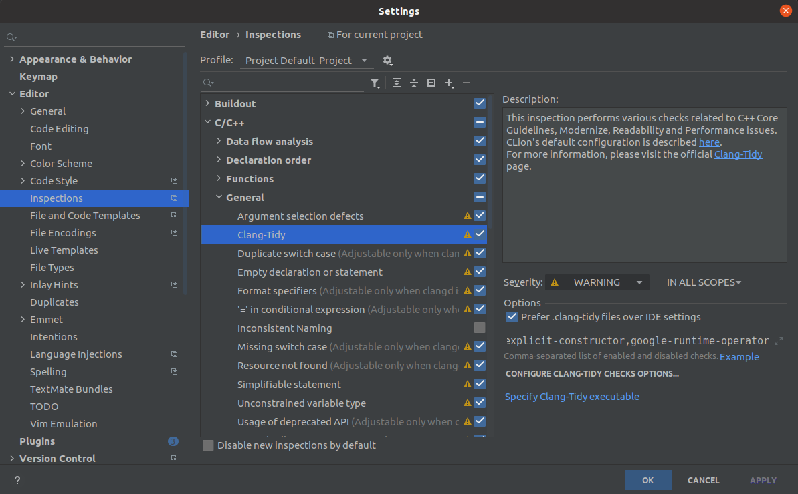

# CLion

## [Установка](https://www.jetbrains.com/help/clion/installation-guide.html)
На официальном сайте (ссылка в header-e - кликабельна) можно найти информацию об установке через *Toolbox* (если вы используете другие IDE от Jetbrains) или об установке на __Windows__. 

На __Ubuntu__ рекомендуется следующий процесс установки (чтобы можно было обновлять среду разработки через пакетный менеджер):
```console
$ sudo apt install snap
$ sudo snap install clion --classic
```

## [clang-tidy](https://www.jetbrains.com/help/clion/clang-tidy-checks-support.html)
__Clion__ имеет встроенный *clang-tidy*, но вы можете указать внешний, если он есть на вашей системе.

> Нужно убедиться, что вы поставили галочку на `Prefer .clang-tidy files over IDE settings` чтобы использовать __.clang-tidy__ курса.

Path: `Settings / Preferences | Editor | Inspections - C/C++, General, Clang-Tidy`


